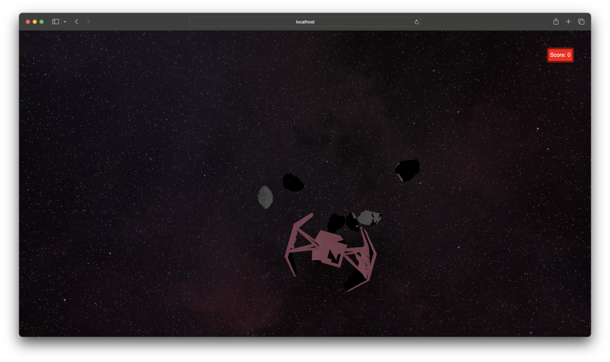

# Space Shooter Game

Welcome to the Space Shooter Game! In this thrilling 3D experience, you control a spaceship and navigate through a field of asteroids. Your goal is to destroy the incoming asteroids and achieve the highest score possible.

 ## Screenshot

 

## Controls

- **Arrow Keys**: Move the spaceship up, down, left, and right.
- **Spacebar**: Shoot projectiles to destroy the incoming asteroids.

## Features

- **Asteroid Destruction**: Shoot asteroids to increase your score.
- **OBJ Loader**: Utilize custom 3D objects by importing .obj files, allowing for a variety of spaceship designs and asteroid shapes.
- **Cubemap Integration**: Enjoy a stunning background with a built-in cubemap, enhancing the visual experience of the game.
- **3D Objects**: Experience a fully immersive environment with detailed 3D models.

## Getting Started

To run this demo you need nodejs installed. 
For best developing experience open the project in Visual Studio Code and install all recommended extensions.

Install dependencies:
```sh
/> npm i 
```

Run server from Terminal:
```sh
/> npm run dev
```

Run server from Visual Studio Code: Run the "Run Development Server" Task (optionally through the Task Runner extension).